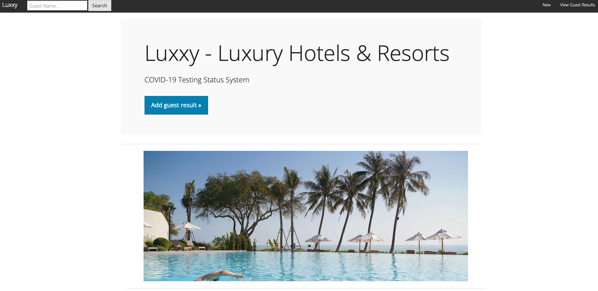

# Hotel-Management-System

Simulating Real-World problem of migrating an "on-premises" application & database to Multicloud Architecture.


 ============================================================================================== <br>
                                Walkthorugh<br>
 ============================================================================================== <br>

1. Create the ```terraform``` user using the IAM service and give ```AmazonS3FullAccess``` permission to this user
2. Download the .csv file and place it root folder
3. In the Google console, 
    ```
    chmod +x *.sh
    mkdir -p ~/.aws/
    touch ~/.aws/credentials_multiclouddeploy
    ./aws_set_credentials.sh <your-access-key>.csv
    GOOGLE_CLOUD_PROJECT_ID=$(gcloud config get-value project)
    gcloud config set project $GOOGLE_CLOUD_PROJECT_ID
    ./gcp_set_project.sh
    ```
4. Execute the commands to enable the Kubernetes, Container Registry, and Cloud SQL APIs
    ```
    gcloud services enable containerregistry.googleapis.com
    gcloud services enable container.googleapis.com
    gcloud services enable sqladmin.googleapis.com
    gcloud services enable cloudresourcemanager.googleapis.com
    gcloud services enable serviceusage.googleapis.com
    gcloud services enable compute.googleapis.com
    gcloud services enable servicenetworking.googleapis.com --project=$GOOGLE_CLOUD_PROJECT_ID
    gcloud services enable cloudbuild.googleapis.com
    ```
5. Running Terraform to provision MultiCloud infrastructure in Google Cloud
    ```
    cd terraform
    terraform init
    terraform plan
    terraform apply
    ```
6. create a new user `app` with password `password` on Cloud SQL MySQL database 
7. Connect to MySQL DB ``` mysql --host=<replace_with_public_ip_cloudsql> --port=3306 -u app -p ```
8. create the products table for testing purposes
    ```
    use dbcovidtesting;
    source ~/db/create_table.sql
    show tables;
    exit;
    ```
9. Build the Docker image and push it to Google Container Registry.
    ```
     gcloud builds submit --tag gcr.io/$GOOGLE_CLOUD_PROJECT_ID/luxxy-covid-testing-system-app-en
    ```
11. Edit the Kubernetes deployment file
    ```
    image: gcr.io/<PROJECT_ID>/luxxy-covid-testing-system-app-en:latest
    ...
    - name: AWS_BUCKET
        value: "<your-s3-bucket-name>"
    - name: S3_ACCESS_KEY
        value: "xxxxxxxxxxxxxxxxxxxxx"
    - name: S3_SECRET_ACCESS_KEY
        value: "xxxxxxxxxxxxxxxxxxxx"
    - name: DB_HOST_NAME
        value: "<ptivate-ip>"
    ```
12. Connect to the GKE (Google Kubernetes Engine) cluster via Console
13. Deploy the application Luxxy in the Cluste 
```kubectl apply -f luxxy-covid-testing-system.yaml```
14. Under GKE > Workloads > Exposing Services, get the application Public IP
15. Import the dump on Cloud SQL
    ``` source ~/mission3/en/db/db_dump.sql```
16. In AWS cloud shell,
    ```
    upload folder <pdf_files>
    aws s3 sync . s3://<your-s3-bucket-name>
    ```

 ============================================================================================== <br>
                                Screen Shots
 ============================================================================================== <br>



Credits :  for providing a great course